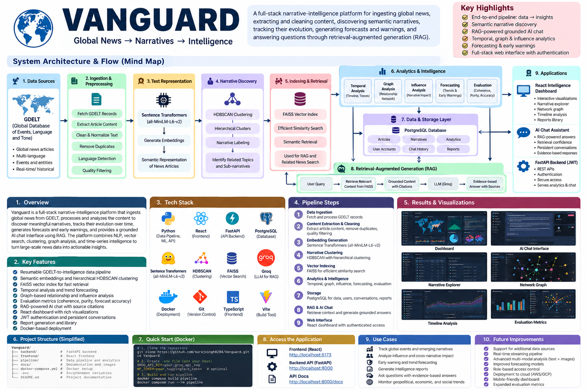
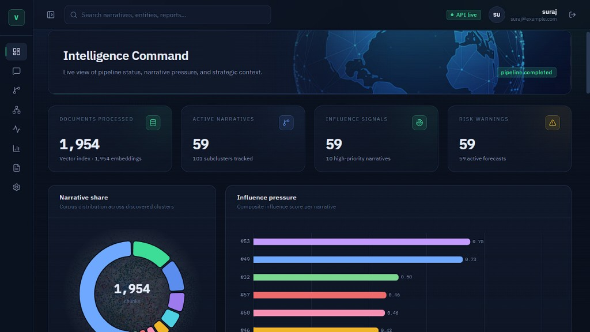
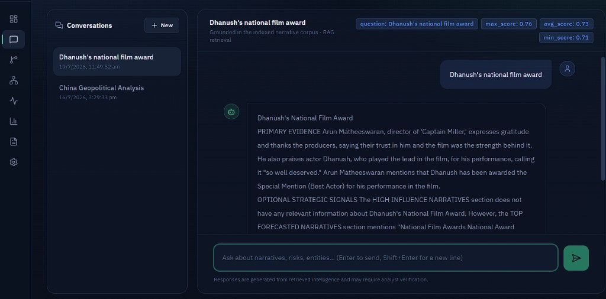
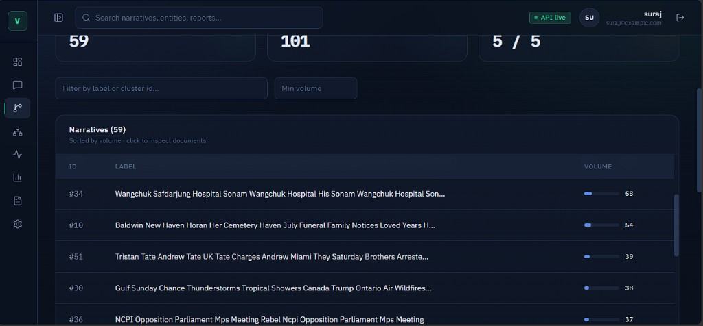
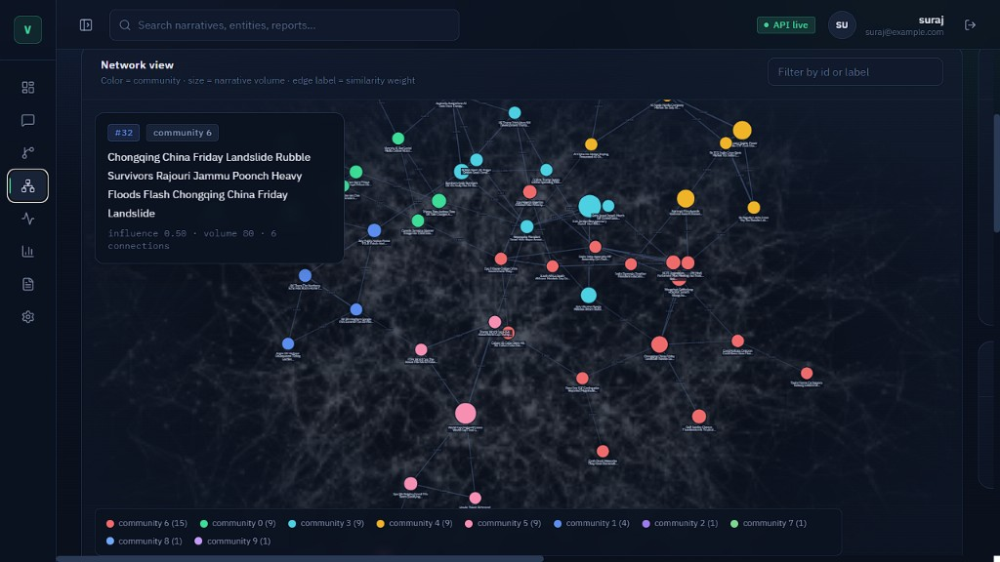
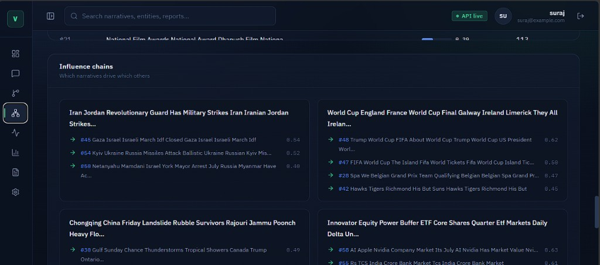
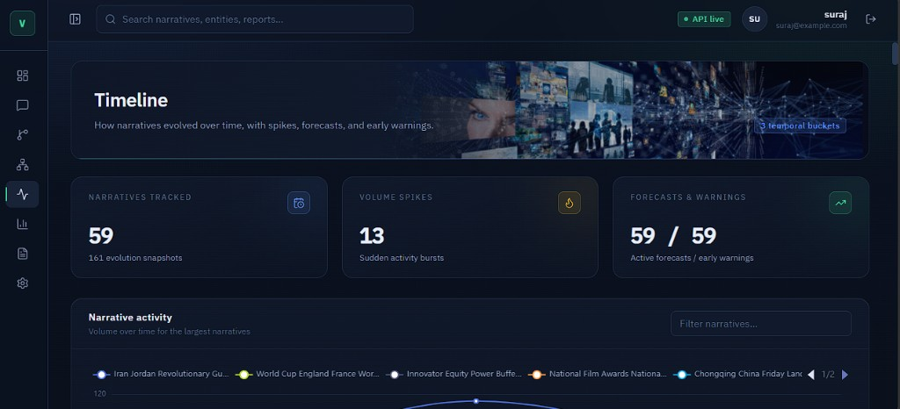
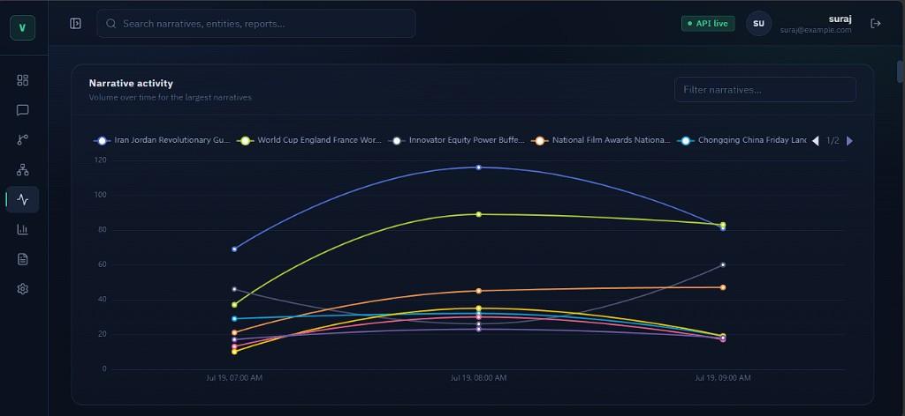
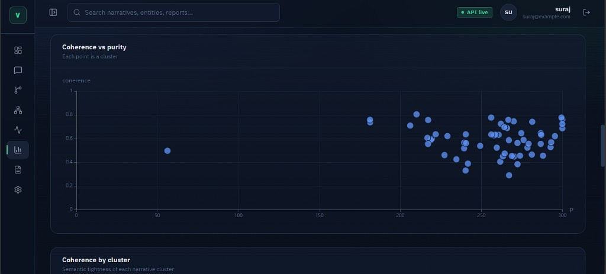
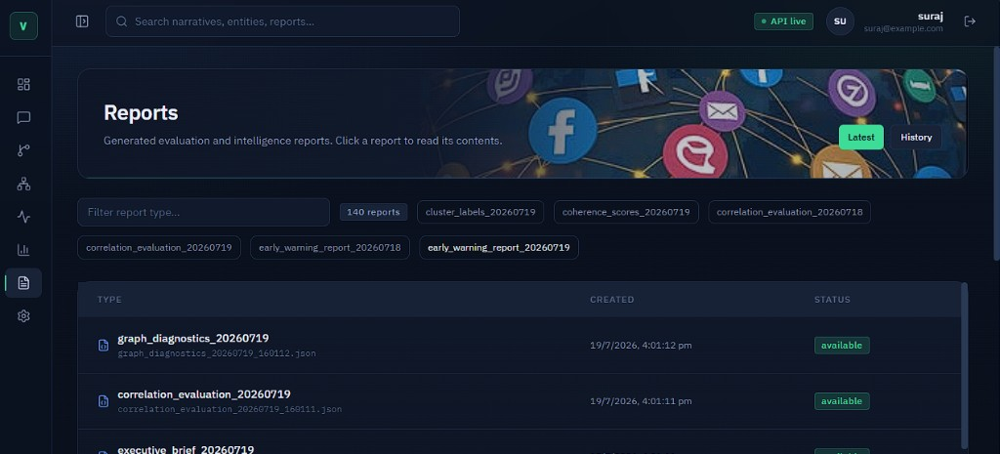

# Vanguard

**A full-stack narrative-intelligence platform for discovering, tracking, analyzing, and querying emerging narratives across global news.**

[](https://www.python.org/)
[](https://fastapi.tiangolo.com/)
[](https://react.dev/)
[](https://www.typescriptlang.org/)
[](https://www.docker.com/)

## Overview

Vanguard is a media-intelligence system that turns large volumes of global news into structured narrative intelligence.

The platform combines a resumable data pipeline, semantic embeddings, hierarchical clustering, vector retrieval, temporal and graph analytics, forecasting, evaluation, reports, and a grounded RAG chat interface in one end-to-end application.

The project was developed as an AI/ML engineering project with a strong focus on practical pipeline reliability, retrieval quality, analytics, and full-stack delivery.

## What Vanguard does

Vanguard provides an end-to-end workflow:

```text
GDELT GKG feeds
      ↓
Data ingestion
      ↓
Article extraction & cleaning
      ↓
Quality / language / duplicate screening
      ↓
Sentence Transformer embeddings
      ↓
HDBSCAN narrative clustering
      ↓
FAISS vector index
      ↓
Narrative / temporal / graph / forecast analytics
      ↓
Reports + intelligence artifacts
      ↓
FastAPI backend
      ↓
React intelligence dashboard + grounded AI chat
```

## Key capabilities

### Intelligence pipeline

- GDELT GKG feed discovery, download, parsing, and raw archival
- Bounded and resumable ingestion batches
- Concurrent article downloading and content extraction
- Trafilatura extraction with Beautiful Soup fallback
- Boilerplate purification and metadata validation
- Quality, language, and duplicate-content screening
- Sentence Transformer embeddings with per-batch checkpoints
- Main narrative clustering and hierarchical subclustering with HDBSCAN
- Human-readable cluster and subcluster labels
- Cluster-aware cosine retrieval through FAISS
- Temporal trend, spike, momentum, emergence, and evolution analysis
- Narrative relationship graphs, communities, centrality, and influence analysis
- Forecasts, baseline comparisons, forecast evaluation, and early warnings
- Coherence, separation, purity, correlation, and label-audit artifacts
- Intelligence briefs, impact reports, executive briefs, and strategic context
- Artifact validation before a pipeline run is marked complete

### Full-stack application

- User registration and login
- JWT-based authentication and protected routes
- Intelligence command dashboard
- Narrative and subcluster exploration
- Interactive relationship/network visualization
- Influence-chain exploration
- Timeline, spike, forecast, warning, and correlation views
- Evaluation and quality metrics
- Generated report browser
- Grounded AI chat with retrieval confidence
- Persistent conversations stored in PostgreSQL

## Architecture

Vanguard separates the long-running intelligence pipeline from the application layer while connecting ingestion, NLP, retrieval, analytics, RAG, and the web interface into an end-to-end intelligence system.



### High-Level Flow

``` text
GDELT
  ↓
Data Ingestion
  ↓
Article Extraction & Cleaning
  ↓
Sentence Transformer Embeddings
  ↓
HDBSCAN Narrative Clustering
  ↓
FAISS Vector Store
  ↓
Analytics & Evaluation
  ↓
Generated Intelligence Artifacts
  ↓
FastAPI Backend
  ├── PostgreSQL
  ├── RAG Retrieval
  └── Groq Grounded Generation
  ↓
React + TypeScript Dashboard
```

### Separation of responsibilities

The project intentionally separates long-running ML work from the application runtime:

- `pipeline/` orchestrates long-running ingestion and ML stages.
- `core/` contains ingestion, processing, embeddings, clustering, retrieval, analytics, and output logic.
- `backend/` serves APIs, authentication, conversations, artifacts, and AI queries.
- `frontend/` provides the analyst workspace and chat experience.
- PostgreSQL stores users, conversations, and messages.
- Analytics are primarily artifact-backed rather than stored as large relational datasets.

## RAG and retrieval flow

The chat layer uses the indexed narrative corpus as an external knowledge source instead of asking the language model to answer from free-form model memory alone.

```text
User question
      ↓
FastAPI /query/
      ↓
Embed query
      ↓
Global FAISS search
      ↓
Select relevant narrative clusters
      ↓
Cluster-local retrieval
      ↓
Enrich + rerank + diversify by subcluster
      ↓
Confidence threshold
      ↓
Retrieved evidence + strategic context
      ↓
Groq / Llama 3.1 generation
      ↓
Answer + persisted conversation
```

The system rejects low-confidence retrieval rather than forcing an answer. Retrieved chunks are enriched, reranked, and diversified before generation.

## Pipeline stages

### 1. Ingestion

1. Generate GDELT GKG feed URLs for the configured history window.
2. Download and parse feeds.
3. Deduplicate article URLs.
4. Write bounded JSON ingestion batches.
5. Stop at the configured article limit or when feeds are exhausted.

### 2. Preprocessing

1. Fetch article HTML concurrently.
2. Extract readable article content.
3. Purify document content.
4. Reject low-quality, malformed, duplicate, or invalid records.
5. Append accepted records to resumable JSONL.
6. Publish the enriched processed dataset.

### 3. Model build

1. Chunk accepted article content.
2. Embed chunks in configured batches.
3. Cluster embeddings with HDBSCAN.
4. Build subclusters and human-readable labels.
5. Create the normalized FAISS vector index with narrative metadata.

Clustering is performed before final FAISS creation because vector metadata contains narrative and subcluster identifiers used by retrieval.

### 4. Analytics and artifacts

The analytics stage generates:

- timelines, spikes, emerging narratives, and evolution signals;
- narrative graphs, communities, centrality diagnostics, and influence;
- statistics, forecasts, baselines, hit evaluation, and early warnings;
- coherence, separation, purity, correlation, and label audits;
- intelligence briefs, impact reports, executive briefs, and strategic context;
- system metadata and pipeline status.

### 5. Validation

The pipeline validates required generated artifacts before marking a run complete. Missing or empty required outputs cause the run to fail rather than being silently treated as successful.

## RAG quality and evaluation

Vanguard includes evaluation artifacts intended to make the quality of the intelligence pipeline inspectable after rebuilds.

Tracked signals include:

- cluster coherence;
- separation / purity;
- label audits;
- forecast hit rates;
- Vanguard-vs-baseline correlation;
- retrieval confidence;
- pipeline artifact validation.

This makes evaluation part of the pipeline rather than a separate manual afterthought.

## Feature showcase

The repository includes screenshots from local completed pipeline runs. Since the corpus is rebuilt from GDELT windows, labels, counts, timestamps, and other metrics may change between runs.

### Intelligence Command



A command view for pipeline health, processed documents, active narratives, influence pressure, risk warnings, narrative share, and strategic context.

### Grounded AI Chat



Questions are answered against the FAISS corpus with retrieval confidence and persistent conversation history.

### Narrative Explorer



Explore discovered clusters, volumes, labels, supporting documents, and subclusters.

### Relationship Network



Interactive graph of narrative relationships, community membership, node volume, similarity, and influence-related signals.

### Influence Chains



Explore how high-pressure narratives connect to related discourse.

### Temporal Intelligence





Track narrative activity, evolution snapshots, spikes, forecasts, and early warnings. Single-day corpora can fall back to hourly buckets so temporal views remain usable.

### Evaluation



Inspect coherence, purity, label audits, forecast hit rates, and baseline correlation.

### Generated Reports



Browse generated intelligence and evaluation artifacts through authenticated API endpoints.

## Repository structure

```text
vanguard/
├── backend/                 FastAPI API, auth, database models, services
├── core/
│   ├── ingestion/           GDELT feed client, parser, raw storage
│   ├── processing/          fetching, extraction, cleaning, validation, ETL
│   ├── embeddings/          Sentence Transformer embedding service
│   ├── clustering/          HDBSCAN main and subcluster engines
│   ├── vectorstore/         FAISS storage and retrieval
│   ├── intelligence/        reranking, RAG, strategic context
│   ├── analytics/           narrative, graph, forecast, evaluation engines
│   ├── outputs/             briefs and impact reports
│   ├── pipeline/            AI build/query/analytics owner
│   └── artifacts/           generated intelligence artifacts
├── data_lake/
│   ├── raw/                 raw article metadata batches
│   ├── raw_feeds/           downloaded GDELT archives
│   └── processed/           enriched article dataset
├── docs/images/              README feature screenshots
├── docker/                   pipeline Dockerfile
├── frontend/                 React + TypeScript + Vite application
├── pipeline/                 resumable orchestration and configuration
├── scripts/                  maintenance and analytics rebuild scripts
├── artifacts/pipeline/       checkpoints, state, and logs
├── compose.yaml              pipeline + PostgreSQL services
└── requirements.txt          Python environment snapshot
```

## Technology stack

### Data and machine learning

- Python 3.11
- GDELT
- Requests
- Trafilatura
- Beautiful Soup
- Sentence Transformers
- PyTorch
- HDBSCAN
- scikit-learn
- NumPy

### Retrieval and generation

- FAISS
- Groq
- Llama 3.1

### Analytics

- NetworkX
- Temporal statistics
- Forecasting engines
- Evaluation engines

### Backend

- FastAPI
- SQLAlchemy
- PostgreSQL
- JWT authentication

### Frontend

- React 19
- TypeScript
- Vite
- TanStack Query
- ECharts
- Recharts
- Cytoscape
- Framer Motion
- Tailwind CSS

### Operations

- Docker Compose
- Resumable JSON / JSONL / NumPy checkpoints
- Rotating logs

## Quick start: complete pipeline with Docker

### Prerequisites

- Docker Desktop with Docker Compose v2
- Internet access to GDELT, article sites, Hugging Face, and Groq
- A Groq API key
- Enough local storage for feeds, model cache, embeddings, and generated artifacts

### 1. Clone the repository

```bash
git clone https://github.com/surajsingh8204/Vanguard.git
cd Vanguard
```

### 2. Create the root environment file

Create `.env` in the repository root:

```env
GROQ_API_KEY=your_groq_api_key
HF_TOKEN=
```

`HF_TOKEN` is optional for the public default embedding model. Do not commit real secrets.

### 3. Build and run the pipeline

```bash
docker compose build pipeline
docker compose run --rm pipeline
```

The pipeline runs in the foreground and writes persistent outputs back to mounted host directories.

### 4. Monitor pipeline logs

From another PowerShell terminal:

```powershell
Get-Content artifacts/pipeline/logs/pipeline.log -Wait
```

If interrupted, run the same pipeline command again. Completed work is restored from checkpoints.

## Pipeline outputs

Typical generated locations include:

```text
data_lake/                  downloaded and processed datasets
core/artifacts/              FAISS, analytics, evaluation, and report artifacts
artifacts/pipeline/          checkpoints, state, embedding batches, and logs
```

Important artifacts include:

```text
core/artifacts/vectorstore/faiss.index
core/artifacts/vectorstore/metadata.json
core/artifacts/narrative/clusters.json
core/artifacts/narrative/cluster_labels.json
core/artifacts/narrative/statistics.json
core/artifacts/narrative/timeline.json
core/artifacts/narrative/emerging.json
core/artifacts/narrative/forecasts.json
core/artifacts/narrative/early_warnings.json
core/artifacts/graphs/nodes.json
core/artifacts/graphs/edges.json
core/artifacts/evaluation/coherence.json
core/artifacts/evaluation/purity.json
core/artifacts/evaluation/forecast_evaluation.json
core/artifacts/evaluation/correlation.json
core/artifacts/metadata/executive_brief.json
core/artifacts/metadata/pipeline_status.json
```

## Resumability and pipeline operations

### Dry run

```bash
docker compose run --rm pipeline python pipeline/run_pipeline.py --dry-run
```

### Resume an interrupted run

```bash
docker compose run --rm pipeline
```

### Start a fresh run

```bash
docker compose run --rm pipeline python pipeline/run_pipeline.py --no-resume
```

### Re-run from a stage

```bash
docker compose run --rm pipeline python pipeline/run_pipeline.py --from-stage model_build
```

Supported stages:

```text
ingestion
preprocessing
model_build
analytics_artifacts
validation
```

Examples:

```bash
# Reprocess accepted data and rebuild downstream stages
docker compose run --rm pipeline python pipeline/run_pipeline.py --from-stage preprocessing

# Rebuild embeddings, clustering, FAISS, and downstream analytics
docker compose run --rm pipeline python pipeline/run_pipeline.py --from-stage model_build

# Regenerate analytics without rebuilding the model
docker compose run --rm pipeline python pipeline/run_pipeline.py --from-stage analytics_artifacts
```

## Configuration

Edit `pipeline/config.yaml` to adjust the pipeline.

| Setting | Default | Purpose |
|---|---:|---|
| `ingestion.articles_limit` | `25000` | Maximum collected articles |
| `ingestion.hours_back` | `168` | GDELT lookback window |
| `preprocessing.workers` | `10` | Fetch/extraction concurrency |
| `embeddings.model` | `all-MiniLM-L6-v2` | Sentence Transformer model |
| `embeddings.embedding_batch_size` | `64` | Embedding inference batch size |
| `embeddings.device` | `auto` | CPU/CUDA/automatic device selection |
| `vector_database.rebuild_vectors` | `true` | Rebuild vector index |
| `artifacts.rebuild_artifacts` | `true` | Rebuild analytics artifacts |
| `pipeline.resume` | `true` | Resume incomplete work |

For lower-memory machines, reduce `ingestion.articles_limit`. HDBSCAN and some analytics stages operate on large in-memory collections.

## Running the full application locally

### Backend requirements

- Python 3.11 recommended
- Conda recommended
- Docker Desktop for PostgreSQL
- Node.js `^20.19.0` or `>=22.12.0`

### 1. Start PostgreSQL

```bash
docker compose up -d postgres
docker compose ps
```

### 2. Prepare Python environment

```bash
conda create -n vanguard python=3.11 -y
conda activate vanguard
python -m pip install --upgrade pip packaging
```

The tracked environment snapshot contains a machine-specific `packaging @ file:///...` entry. For a portable local install, install a temporary filtered copy as described below:

```powershell
python -c "from pathlib import Path; src=Path('requirements.txt').read_text().splitlines(); Path('requirements.local.txt').write_text('\\n'.join(x for x in src if not x.startswith('packaging @ file:')) + '\\n')"
python -m pip install -r requirements.local.txt
python -m pip install "python-jose[cryptography]" "passlib[bcrypt]" psycopg2-binary python-multipart email-validator
Remove-Item requirements.local.txt
```

### 3. Configure backend environment

Copy the example environment file:

```powershell
Copy-Item backend/.env.example backend/.env
```

Set values appropriate for local development, including:

```env
APP_NAME=Vanguard Backend
APP_VERSION=0.6.0
HOST=127.0.0.1
PORT=8000
DATABASE_URL=postgresql+psycopg2://vanguard:<local-password>@localhost:5432/vanguard_db
SECRET_KEY=<long-random-secret>
ALGORITHM=HS256
ACCESS_TOKEN_EXPIRE_MINUTES=60
GROQ_API_KEY=<your-groq-api-key>
```

Generate a development secret with:

```bash
python -c "import secrets; print(secrets.token_urlsafe(48))"
```

### 4. Initialize the database

```bash
python -m backend.src.database.init_db
```

### 5. Start the API

```bash
python -m uvicorn backend.src.main:app --reload --host 127.0.0.1 --port 8000
```

Useful endpoints:

- `/`
- `/health/`
- `/docs`

### 6. Start the frontend

```powershell
Set-Location frontend
npm install
npm run dev
```

By default, the frontend uses `http://127.0.0.1:8000` as the API URL. To override it, create `frontend/.env`:

```env
VITE_API_URL=http://127.0.0.1:8000
```

Then open the Vite development server in your browser.

## API overview

The FastAPI backend uses bearer JWT authentication. With the exception of the root, health, registration, and login routes, application endpoints require:

```http
Authorization: Bearer <access_token>
```

| Method | Endpoint | Purpose |
|---|---|---|
| GET | `/health/` | Service health |
| POST | `/auth/register` | Create an account |
| POST | `/auth/login` | Obtain access token |
| GET | `/auth/me` | Current account |
| GET | `/dashboard/` | System and executive summary |
| GET | `/narrative/summary` | Narrative aggregate data |
| GET | `/narrative/clusters` | Filterable narrative clusters |
| GET | `/graphs/summary` | Graph metrics |
| GET | `/graphs/network` | Network nodes and edges |
| GET | `/temporal/timeline` | Timeline, spikes, forecasts, warnings |
| GET | `/evaluation/summary` | Evaluation and correlation results |
| GET | `/reports/latest` | Latest generated reports |
| GET | `/reports/history` | Report history |
| GET | `/reports/content` | Report content lookup |
| POST | `/query/` | Grounded AI query + message persistence |
| POST | `/conversations/` | Create conversation |
| GET | `/conversations/` | List conversations |
| GET | `/conversations/{id}` | Load conversation |
| PATCH | `/conversations/{id}` | Rename conversation |
| DELETE | `/conversations/{id}` | Delete conversation |

Use `/docs` for complete request and response schemas.

## Frontend pages

| Route | Feature |
|---|---|
| `/login`, `/register` | Authentication |
| `/dashboard` | Pipeline health, volumes, influence, risks, executive brief |
| `/chat` | RAG chat and conversation history |
| `/narratives` | Cluster, label, volume, and subcluster exploration |
| `/graph` | Narrative relationship network and influence chains |
| `/timeline` | Temporal evolution, forecasts, warnings, correlations |
| `/evaluation` | Cluster and forecast quality metrics |
| `/reports` | Generated reports and report content |
| `/settings` | Profile, API endpoint, and logout |

## Development commands

### Pipeline

```bash
conda activate vanguard
python pipeline/run_pipeline.py
python pipeline/run_pipeline.py --dry-run
python pipeline/run_pipeline.py --from-stage model_build
python pipeline/run_pipeline.py --no-resume
```

### Backend

```bash
conda activate vanguard
python -m backend.src.database.init_db
python -m uvicorn backend.src.main:app --reload
```

### Frontend

```bash
cd frontend
npm run dev
npm run lint
npm run build
npm run preview
```

### Tests

The orchestration tests use Python's built-in `unittest`:

```bash
conda activate vanguard
python -m unittest pipeline.tests.test_orchestrator -v
```

## Common maintenance operations

### Rebuild analytics from existing clustered data

```bash
conda activate vanguard
python scripts/rebuild_analytics.py
```

### Reduce corpus size

Edit:

```yaml
ingestion:
  articles_limit: 5000
```

Then start a fresh run or rerun from ingestion.

### Force CPU

```yaml
embeddings:
  device: cpu
```

### Use NVIDIA GPU

Set `embeddings.device: cuda` only when the environment has a CUDA-enabled PyTorch build and GPU access configured.

## Reliability and engineering decisions

### Resumable pipeline

The pipeline stores stage checkpoints, state, embedding batches, and logs so interrupted runs can resume rather than restarting everything.

### Bounded ingestion and processing

Ingestion and preprocessing use bounded batches and configurable concurrency to keep long-running jobs controllable.

### Artifact-first analytics

Expensive analytics are generated once and persisted as artifacts. The application then reads those artifacts rather than recomputing the analysis on every request.

### Retrieval confidence

The chat pipeline can reject low-confidence retrieval instead of fabricating an answer from weak evidence.

### Separate application runtime

Long-running ingestion/model-building tasks are separated from the FastAPI + React runtime, reducing coupling between batch computation and interactive usage.

## Security notes

- Never commit `.env` files or API keys.
- Use a long random `SECRET_KEY` outside development.
- Change all development PostgreSQL credentials before any non-development deployment.
- If a secret was ever committed, rotate it and remove it from Git history; `.gitignore` alone does not erase historical commits.
- Review scraping permissions, source terms, rate limits, and data-retention requirements before production use.
- Generated artifacts can contain source-derived text and should be treated as data, not automatically committed to the repository.

## Known limitations

- The ML build can be memory intensive because clustering and some analytics operate on large in-memory collections.
- Core clustering and analytics are not fully incremental; rebuilding a model stage can require substantial recomputation.
- FAISS currently uses an exact flat index, so search and memory requirements grow with the corpus.
- The current project creates database tables with SQLAlchemy `create_all`; there is no Alembic migration chain yet.
- The local Compose setup containerizes the pipeline and PostgreSQL, while the FastAPI backend and React frontend run locally using the documented commands.
- Forecasts and early warnings are analytical signals, not verified facts or operational decisions.

## Project highlights

Vanguard demonstrates an end-to-end AI engineering workflow rather than a single model:

```text
Data engineering
    ↓
NLP / semantic representation
    ↓
Unsupervised learning
    ↓
Vector retrieval
    ↓
RAG
    ↓
Temporal + graph analytics
    ↓
Forecasting + evaluation
    ↓
FastAPI + PostgreSQL
    ↓
React intelligence dashboard
    ↓
Dockerized, resumable execution
```

## Repository

GitHub: `surajsingh8204/Vanguard`

## Author

**Suraj Singh**

AI/ML Engineer focused on machine learning, NLP, Generative AI, RAG, Agentic AI, and production-oriented AI systems.
